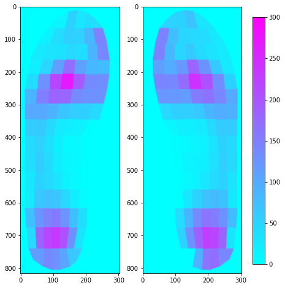

.. pedarProbe documentation master file, created by
   sphinx-quickstart on Wed Dec  7 15:28:20 2022.
   You can adapt this file completely to your liking, but it should at least
   contain the root `toctree` directive.

Welcome to pedarProbe's documentation!
======================================

Data analysis framework for pedar plantar pressure sensor.

.. tip::
   Before jump into the :doc:`api`, please read the :doc:`dev notes` to get an overall understanding of the technical settings and program structure.

   
   An example averaged foot peak pressure distribution heatmap.

.. toctree::
   :maxdepth: 100
   :caption: Contents:

   dev notes
   api

Indices and tables
==================

* :ref:`genindex`
* :ref:`modindex`
* :ref:`search`
